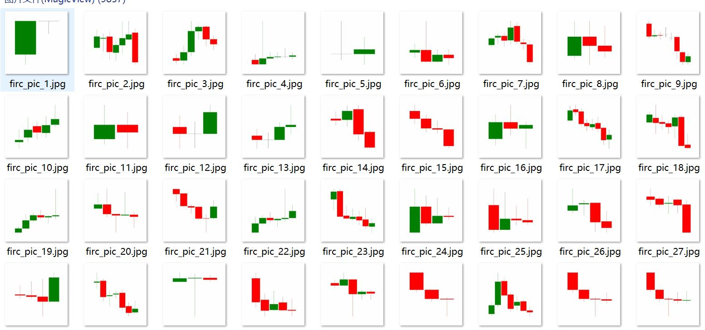
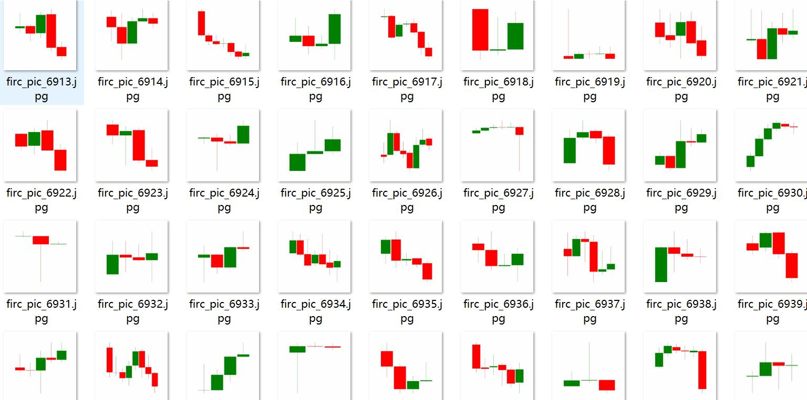
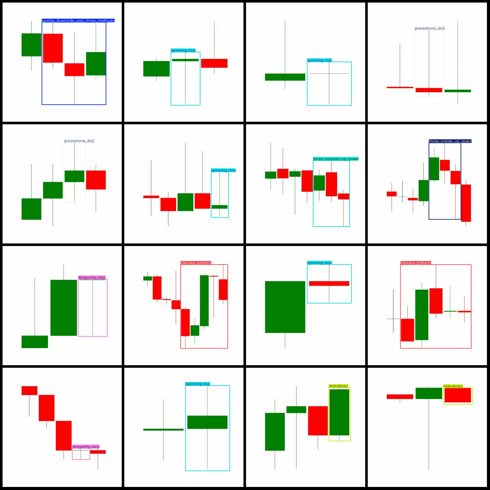
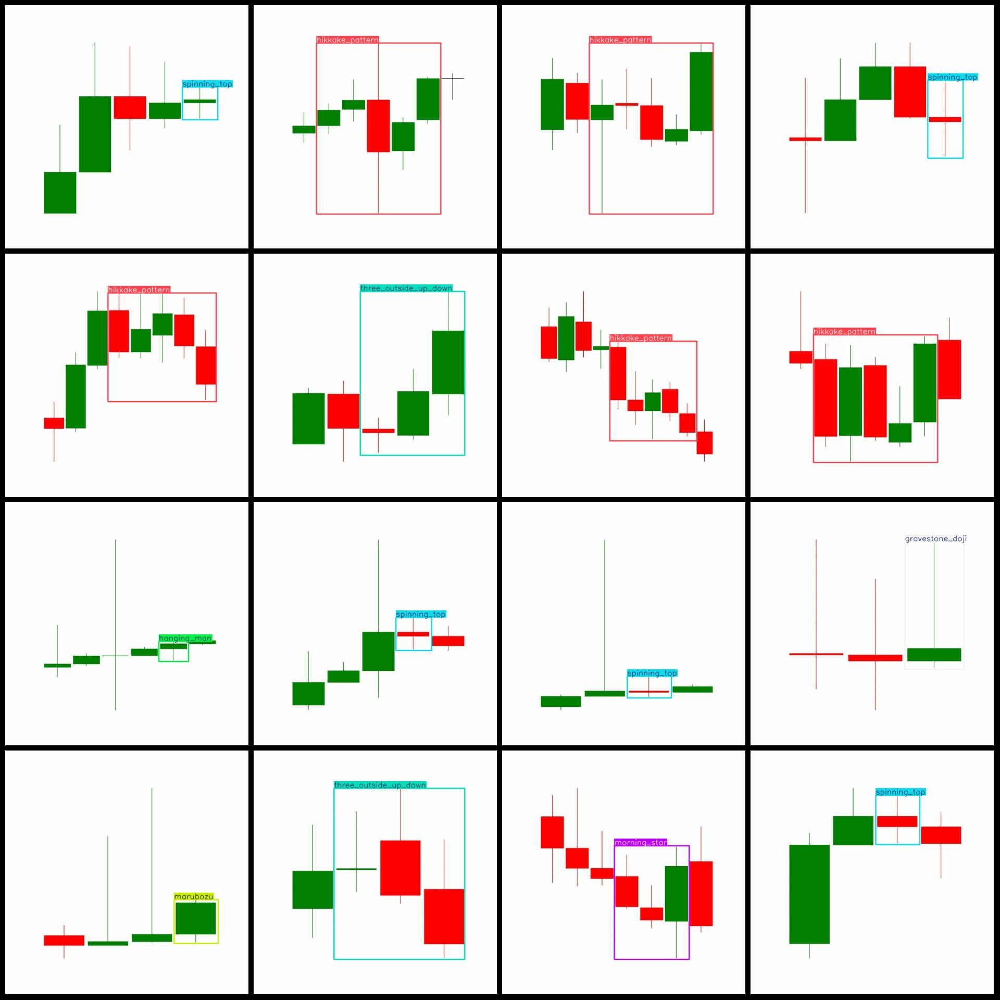

# K-Line Technical Analysis Classical Form Detection Dataset VOC+YOLO Format with 9857 Images of 26 Categories

```
# K-Line Technique Analysis Classical Patterns Detection Data Set VOC+YOLO Format 9857 Categories

The number of jpg files is 9857.
The XML file count is 9857.
The number of categories is 26.
The given list of categories appears to be in the wrong order compared to the YOLO format. The correct order should match the labels folder's 'classes.txt' file.

Here is a possible mapping of the given list of categories to the correct order:

1. Advanced Block
2. Dragonfly Doji
3. Evening Doji Star
4. Evening Star
5. Gravestone Doji
6. Hammer
7. Hanging Man
8. Hikkake Pattern
9. Identical Three Crows
10. Ladder Bottom
11. Marubozu
12. Morning Doji Star
13. Morning Star
14. Rising Falling Three Methods
15. Spinning Top
16. Stick Sandwich
17. Tasuki Gap
18. Three Advancing White Soldiers
19. Three Black Crows
20. Three Inside Up Down
21. Three Line Strike
22. Three Outside Up Down
23. Tristar Pattern
24. Unique 3 River
25. Up Down Gap Side By Side White Lines
26. Upside Downside Gap Three Methods

Please note that the above mapping is just one example, and there may be other valid mappings.
"Gravestone Doji" is a technical analysis indicator used in the stock market. It is also known as "Doji Gravestone" or "Doji Flag." This pattern occurs when there are two consecutive days with the same high and low prices, but with no close price on either day. The pattern suggests that there may be uncertainty or lack of confidence in the market sentiment.
1. Identical Three Crows: Frame count = 3
2. Ladder Bottom: Frame count = 2
3. Marubozu: Frame count = 933
4. Morning Doji Star: Frame count = 21
5. Morning Star: Frame count = 70
6. Rising/Falling Three Methods: Frame count = 10
7. Spinning Top: Frame count = 3126
8. Stick Sandwich: Frame count = 2
9. Tasuki Gap: Frame count = 18
10. Three Advancing White Soldiers: Frame count = 6
11. Three Black Crows: Frame count = 5
12. Three Inside Up Down: Frame count = 219
13. Three Line Strikes: Frame count = 77
14. Three Outside Up Down: Frame count = 933
15. Tristar Pattern: Frame count = 6
Upside-downside-gap-three-methods (96)
Total frames: 9857
Advance block (Advanced Block) is a type of graphical user interface element that indicates that a user has reached the end of an input field, such as a text box or a dropdown menu. It can be used to indicate that a user has completed their input and needs to move on to the next step in the process.

In this case, the "advance_block" is a part of a larger UI element that includes a "photo" element with a count of 229. This suggests that there are 229 photos associated with the "advance_block." The exact meaning of this count is not specified in the question, but it could be related to the number of photos displayed in the UI element, the number of photos that have been added to the system, or some other metric related to the photos.
Dragonfly Doji, also known as the Dragonfly Cross, is a type of candlestick pattern that appears on a stock chart. It consists of two consecutive candles with the same opening price and closing price but a different high or low. The Dragonfly Doji is considered a bullish pattern because it suggests that the market is oversold and may rebound soon. However, it is important to note that this pattern does not guarantee a specific outcome and should be analyzed in conjunction with other indicators and market conditions.
The number of gravestones with a bullish doji pattern (bullish Doji) is 688.
Upside Downside Gap Three Methods (Upside Downside Gap Method) is a trading strategy that uses three different methods to identify potential price trends. Here are the steps for each method:

1. Moving Average Crossovers: This method involves identifying two moving averages, such as the 50-day and 200-day moving averages, and crossing them over each other. This indicates an indecisive trend, which can be used to identify potential buying or selling opportunities.

2. Channel Line Crossing: This method involves identifying a channel line, such as the Bollinger Bands, and crossing it over. This indicates an indecisive trend, which can be used to identify potential buying or selling opportunities.

3. Price Action Analysis: This method involves analyzing price action, including candlestick patterns like bullish candlesticks, bearish candlesticks, and gaps. This method can help traders identify potential buying or selling opportunities based on price movement.

Overall, the Upside Downside Gap Three Methods can provide traders with a range of tools to identify potential price trends and make informed trading decisions.
## Images






Here is a pay link on Stripe ( https://buy.stripe.com/3cs8yP7sY87d0vu9AB ). Please contact me lonlonago@foxmail.com after funding $89, and I will send you a complete data files , thank you!


